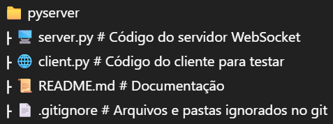

# 🖥️  Simulação de Cliente-Servidor em Python 🐍

Demonstração de um sistema básico de comunicação entre cliente e servidor, em Python utilizando Socket TCP/IP para comunicação em tempo real. Ideal para aplicações que necessitam de troca de mensagens entre cliente e servidor de forma eficiente e escalável, e ajudando a entender como ocorre a comunicação em redes de computadores.

# ✅Funcionalidades

- Comunicação bidirecional via WebSocket
- Implementação simples e leve
- Fácil de entender e personalizar

# 🛠️ Tecnologias Utilizadas

- Python
- Socket (via biblioteca `socket`)

# 📁 Estrutura do Projeto

# ▶️ Como Executar

1️⃣ Instale a dependência:

2️⃣ Execute o servidor:

3️⃣ Execute o cliente (em outro terminal):

